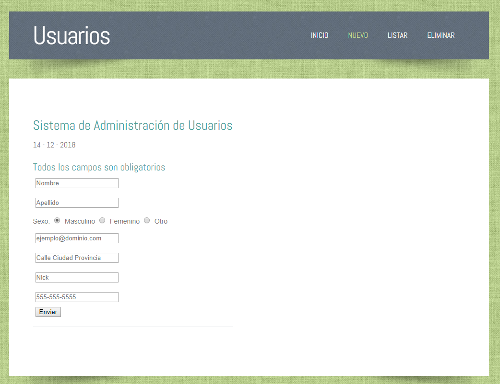
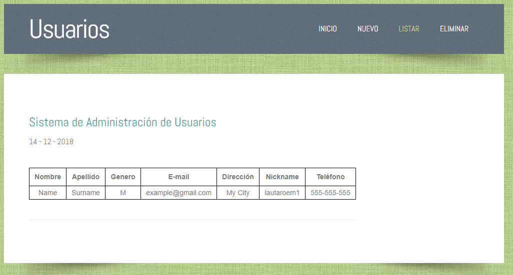

# User System in PHP

## Simple CRUD webpage built in plain PHP.

Add, list and remove users and store all data in a `.TXT` file.
The webpage also checks for bad inputs, like a missing `name` or invalid `email` format.

## Screens

